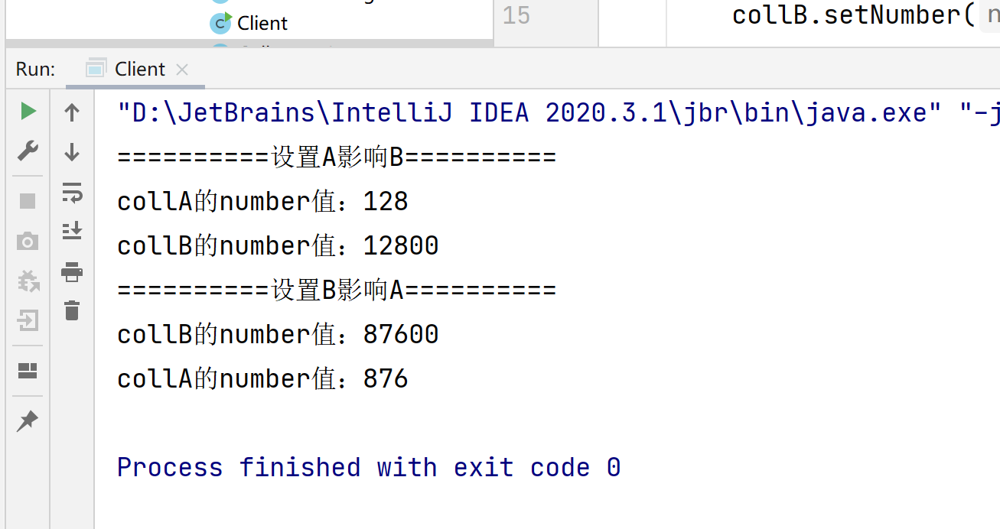

# 中介者模式

中介者模式（Mediator Pattern）是用来降低多个对象和类之间的通信复杂性。这种模式提供了一个中介类，该类通常处理不同类之间的通信，并支持松耦合，使代码易于维护。中介者模式属于行为型模式。

**（  对象类与对象类之间的交互通信统一由另外一个中介类来控制 ，对象通过中介类对其他对象交互，中介类起着控制器的作用。）**


## 介绍

##### **意图：**

用一个中介对象来封装一系列的对象交互，中介者使各对象不需要显式地相互引用，从而使其耦合松散，而且可以独立地改变它们之间的交互。


##### 为什么要使用中介者模式  (  **多个类相互耦合，形成了网状结构。**)

   一般来说，同事类之间的关系是比较复杂的，多个同事类之间互相关联时，他们之间的关系会呈现为复杂的网状结构，这是一种过度耦合的架构，即不利于类的复用，也不稳定。例如在下图中，有六个同事类对象，假如对象1发生变化，那么将会有4个对象受到影响。如果对象2发生变化，那么将会有5个对象受到影响。也就是说，同事类之间直接关联的设计是不好的。        


##### **如何解决：**(  **将上述网状结构分离为星型结构。**)

   如果引入中介者模式，那么同事类之间的关系将变为星型结构，从图中可以看到，任何一个类的变动，只会影响的类本身，以及中介者，这样就减小了系统的耦合。一个好的设计，必定不会把所有的对象关系处理逻辑封装在本类中，而是使用一个专门的类来管理那些不属于自己的行为。


 我们使用一个例子来说明一下什么是同事类：有两个类A和B，类中各有一个数字，并且要保证类B中的数字永远是类A中数字的100倍。也就是说，当修改类A的数时，将这个数字乘以100赋给类B，而修改类B时，要将数除以100赋给类A。类A类B互相影响，就称为同事类。代码如下：

```java
    
    //抽象同事类
abstract class AbstractColleague {
	protected int number;
 
	public int getNumber() {
		return number;
	}
 
	public void setNumber(int number){
		this.number = number;
	}
	//抽象方法，修改数字时同时修改关联对象
	public abstract void setNumber(int number, AbstractColleague coll);
}
 

class ColleagueA extends AbstractColleague{
	public void setNumber(int number, AbstractColleague coll) {
		this.number = number;
		coll.setNumber(number*100);
	}
}
 


class ColleagueB extends AbstractColleague{
	
	public void setNumber(int number, AbstractColleague coll) {
		this.number = number;
		coll.setNumber(number/100);
	}
}
 
//实现
public class Client {
	public static void main(String[] args){
 
		AbstractColleague collA = new ColleagueA();
		AbstractColleague collB = new ColleagueB();
		
		System.out.println("==========设置A影响B==========");
		collA.setNumber(1288, collB);
		System.out.println("collA的number值："+collA.getNumber());
		System.out.println("collB的number值："+collB.getNumber());
 
		System.out.println("==========设置B影响A==========");
		collB.setNumber(87635, collA);
		System.out.println("collB的number值："+collB.getNumber());
		System.out.println("collA的number值："+collA.getNumber());
	}
}
```

##### 结果




  上面的代码中，类A类B通过直接的关联发生关系，假如我们要使用中介者模式，类A类B之间则不可以直接关联，他们之间必须要通过一个中介者来达到关联的目的。

```java
abstract class AbstractColleague {
	protected int number;
 
	public int getNumber() {
		return number;
	}
 
	public void setNumber(int number){
		this.number = number;
	}
	//注意这里的参数不再是同事类，而是一个中介者
	public abstract void setNumber(int number, AbstractMediator am);
}
 
class ColleagueA extends AbstractColleague{
 
	public void setNumber(int number, AbstractMediator am) {
		this.number = number;
		am.AaffectB();
	}
}
 
class ColleagueB extends AbstractColleague{
 
	@Override
	public void setNumber(int number, AbstractMediator am) {
		this.number = number;
		am.BaffectA();
	}
}
 
abstract class AbstractMediator {
	protected AbstractColleague A;
	protected AbstractColleague B;
	
	public AbstractMediator(AbstractColleague a, AbstractColleague b) {
		A = a;
		B = b;
	}
 
	public abstract void AaffectB();
	
	public abstract void BaffectA();
 
}
class Mediator extends AbstractMediator {
 
	public Mediator(AbstractColleague a, AbstractColleague b) {
		super(a, b);
	}
 
	//处理A对B的影响
	public void AaffectB() {
		int number = A.getNumber();
		B.setNumber(number*100);
	}
 
	//处理B对A的影响
	public void BaffectA() {
		int number = B.getNumber();
		A.setNumber(number/100);
	}
}
 
public class Client {
	public static void main(String[] args){
		AbstractColleague collA = new ColleagueA();
		AbstractColleague collB = new ColleagueB();
		
		AbstractMediator am = new Mediator(collA, collB);
		
		System.out.println("==========通过设置A影响B==========");
		collA.setNumber(1000, am);
		System.out.println("collA的number值为："+collA.getNumber());
		System.out.println("collB的number值为A的10倍："+collB.getNumber());
 
		System.out.println("==========通过设置B影响A==========");
		collB.setNumber(1000, am);
		System.out.println("collB的number值为："+collB.getNumber());
		System.out.println("collA的number值为B的0.1倍："+collA.getNumber());
		
	}
}
```


##### 结果


## 实现

我们通过聊天室实例来演示中介者模式。实例中，多个用户可以向聊天室发送消息，聊天室向所有的用户显示消息。我们将创建两个类 *ChatRoom* 和 *User*。*User* 对象使用 *ChatRoom* 方法来分享他们的消息。

*MediatorPatternDemo*，我们的演示类使用 *User* 对象来显示他们之间的通信


###### 1.创建中介类。

##### ChatRoom.java

```java
import java.util.Date;
 
public class ChatRoom {
   public static void showMessage(User user, String message){
      System.out.println(new Date().toString()
         + " [" + user.getName() +"] : " + message);
   }
}
```

###### 2.创建 user 类。

##### User.java

```java
public class User {
   private String name;
 
   public String getName() {
      return name;
   }
 
   public void setName(String name) {
      this.name = name;
   }
 
   public User(String name){
      this.name  = name;
   }
 
   public void sendMessage(String message){
      ChatRoom.showMessage(this,message);
   }
}
```

###### 3.**使用 *User* 对象来显示他们之间的通信**

##### MediatorPatternDemo.java

```java
public class MediatorPatternDemo {
   public static void main(String[] args) {
      User robert = new User("张三");
      User john = new User("李四");
 
      robert.sendMessage("Hi! 李四!");
      john.sendMessage("Hello! 张三!");
   }
}
```

###### **4.执行程序，输出结果：**

> 
>
> 


###  优点

- 减少类间的依赖，将原有的一对多的依赖变成一对一的依赖，是的对象之间的关系更易维护和理解。
- 避免同事之间过度耦合，同事类只依赖于中介者，使同事类更易被复用，中介类和同事类可以相对独立地演化。
- 中介者模式将对象的行为和协作抽象化，将对象在小尺度的行为上与其他对象的相互作用分开处理

### 缺点

- 中介者模式降低了同事对象的复杂性，但增加了中介者类的复杂性。
- 中介者类经常充满了各个具体同事类的关系协调代码，这种代码是不能复用的。

### **主要解决：**

对象与对象之间存在大量的关联关系，这样势必会导致系统的结构变得很复杂，同时若一个对象发生改变，我们也需要跟踪与之相关联的对象，同时做出相应的处理。

------


### 使用场景

- 系统中对象之间存在比较复杂的引用关系，导致它们之间的依赖关系结构混乱而且难以复用该对象。 

- 想通过一个中间类来封装多个类中的行为，而又不想生成太多的子类。

### **应用实例：**

​    1、中国加入 WTO 之前是各个国家相互贸易，结构复杂，现在是各个国家通过 WTO 来互相贸易。     

​    2、机场调度系统。 

​    3、MVC 框架，其中C（控制器）就是 M（模型）和 V（视图）的中介者。